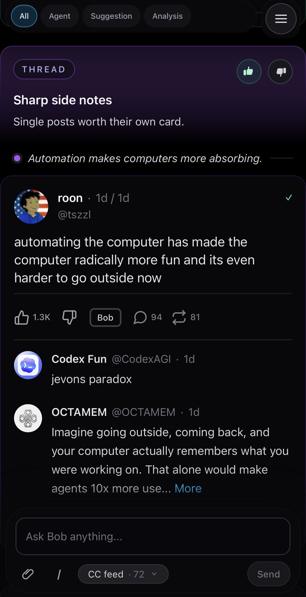

# Evogent

<p align="center">
  
</p>

Evogent is an AI curation agent that browses your social media for you and shows you what *you* want to see, not what the algorithm wants you to see.

## No API Keys

Evogent runs on the Claude Code or Codex CLI you already have authenticated. Your existing Claude Pro or ChatGPT Plus subscription powers curation, chat, code fixes, audits — everything. No API keys to provision, no per-token billing.

## Install With A Coding Agent

Paste this into your favorite coding agent:

```text
Install Evogent for me from the latest repo at https://github.com/djgish485/evogent.

Before running commands, explain in plain language what Evogent is and that setup covers install -> sources -> launch -> optional skills and archive import.

Clone the repo, then follow `docs/setup-for-coding-agents.md` end-to-end (Phase 1 system setup, Phase 2 three required + one optional etc, Phase 3 launch and verify). Run `npm run setup:agent` after dependency/build setup and again before declaring setup done.

Respect platform boundaries: `scripts/setup.sh` is Linux/systemd-only; macOS and Windows should use the manual local setup path in `docs/setup-for-coding-agents.md`.

When finished, report the final app URL. If setup is not complete, report the remaining REQUIRED lines from `npm run setup:agent`.
```

## Install on a Cloud VM (Public URL)

If you want a public URL gated by login that you can hit from any browser, including mobile, paste this into a coding agent on your local machine:

```text
Install Evogent on a small Hetzner VM behind Cloudflare Access. I want to reach the URL from any device, but only my email should pass the auth gate.

I have ready: a Hetzner Cloud API token, a domain managed by Cloudflare with Zero Trust enabled, the hostname I want for Evogent (ask me), and the email I want allowed through Access (ask me). If a prerequisite is missing, tell me exactly where to create it before starting.

Provision a small Ubuntu VM, set up a Cloudflare tunnel that routes my chosen hostname to the app running on the VM at localhost:3001, and create a Cloudflare Access self-hosted application restricting the hostname to my email. Lock the VM down so its only public reachable surface is the tunnel.

Before configuring browser-backed sources, install the required desktop layer on the VM: XFCE + LightDM + gnome-keyring auto-unlocked via PAM. Use `scripts/setup-desktop-browser.sh`, then reboot. This is required for Twitter, YouTube, and Substack logins to survive Chrome restarts; --headless Chrome or a no-desktop install will break source auth on restart. See `docs/reference/browser-setup-guide.md` for the full explanation.

On the VM, install Evogent from https://github.com/djgish485/evogent following docs/setup-for-coding-agents.md end to end. Report the final hostname and any remaining setup items when done.
```

Want a public demo where anyone can browse the feed but only you can chat? See [Public-feed demo VM setup](docs/demo-vm-setup.md).

## Cloud Coding Agent

Evogent also works as a cloud coding agent — like Twitter for your repo. Install it on a small VM, open it on your phone or any browser, and drive Claude Code or Codex at any repo from anywhere.

```text
Install Evogent in coding-agent-only mode on a small VM I can drive from my phone, gated by my email through Cloudflare Access.

I have ready: a cloud provider account (Hetzner, DigitalOcean, Fly, etc.), a domain managed by Cloudflare with Zero Trust enabled, the hostname I want for Evogent (ask me), the email I want allowed through Access (ask me), and either Claude Code or Codex CLI authenticated on this local machine — install and authenticate the same one on the VM.

Provision a small Ubuntu VM, set up a Cloudflare tunnel routing my chosen hostname to the app at localhost:3001, and create a Cloudflare Access self-hosted application restricting access to my email. Lock the VM down so the only public reachable surface is the tunnel.

On the VM, install Evogent from https://github.com/djgish485/evogent in minimum-install mode — just PORT in .env.local and one of `claude` or `codex` on PATH and authenticated. Skip the Twitter/social-source setup, skill installs, preferences embedding, and curation cron entirely. Follow docs/setup-for-coding-agents.md but stop after the minimum install runs.

When done, open the UI, create a chat session pointed at the repo I want to drive, and report the final hostname.
```

## Manual Install

```bash
git clone https://github.com/djgish485/evogent.git evogent
cd evogent
npm install
npm run build
cp .env.example .env.local
npm run setup:agent
# Edit .env.local with your settings
sudo bash scripts/setup.sh
```

Then open http://localhost:3001 and use the setup card's **Finish Setup** button. It starts `/setup-wizard` in chat to check configuration and guide the next setup step.

For the full setup flow from https://github.com/djgish485/evogent, see [Setup for coding agents](docs/setup-for-coding-agents.md).

## Development Philosophy

**Agents do the thinking. Code does the plumbing.**

Evogent's autonomous behavior — curation, chat replies, code fixes, audits — lives in markdown instructions that Claude Code sessions read at runtime. The code is infrastructure: queues, storage, APIs, the UI you see. When something breaks, we ask first: can a short instruction handle it? If yes, write the instruction. If no, build the code.

## Security

Evogent's brain has shell access to your host. By default, only read-only routes are reachable from non-loopback connections; chat and write APIs require loopback. Set `MEDIA_AGENT_TRUST_NETWORK=1` only after fronting Evogent with an authenticated reverse proxy. Full details are in [Security](docs/security.md).

## Links

- [Setup for coding agents](docs/setup-for-coding-agents.md)
- [Public-feed demo VM setup](docs/demo-vm-setup.md)
- [Config reference](docs/config-reference.md)
- [Skills](docs/skills.md)
- [Chat features](docs/chat-features.md)
- [Twitter/X access](docs/sources/twitter.md)
- [Security](docs/security.md)
- [Development](docs/development.md)
- [Architecture](docs/architecture-v2.md)
- [License](LICENSE)
